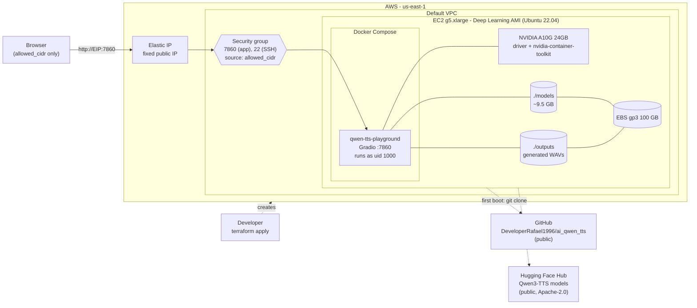
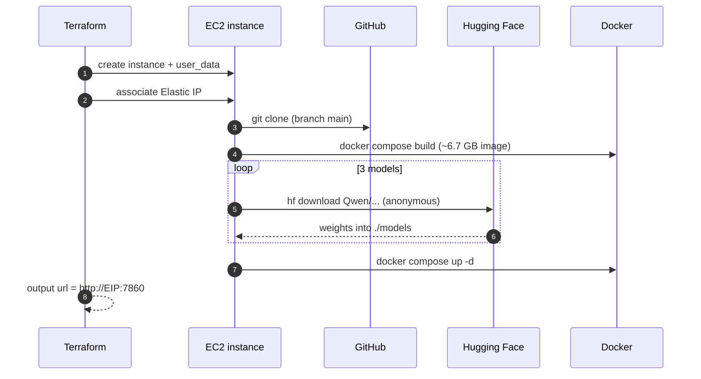
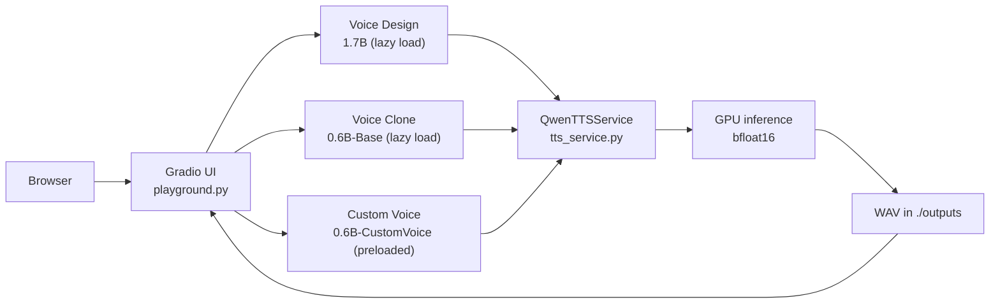

# Architecture

Deployment of the Qwen3-TTS playground on AWS, provisioned with Terraform (`infra/`).
The diagrams are Mermaid: GitHub and VS Code (Markdown preview) render them.

## 1. Infrastructure

## 2. First boot (`user_data`, runs once)

Log: `/var/log/qwen-setup.log`. Takes about 10-15 min before the URL responds.

## 3. Runtime (per request)

## 4. Lifecycle and cost

| State | Compute (~1 $/h) | EBS + Elastic IP | Data / URL |
|---|---|---|---|
| Running | charged | charged | available |
| Stopped (`aws ec2 stop-instances`) | not charged | charged | kept, same URL |
| Destroyed (`terraform destroy`) | not charged | not charged | deleted |

Stopping and starting does not re-run `user_data`; the container comes back on its own
(`restart: unless-stopped`). Changing `user_data` in Terraform **recreates** the instance
(`user_data_replace_on_change = true`) and the disk is lost.
